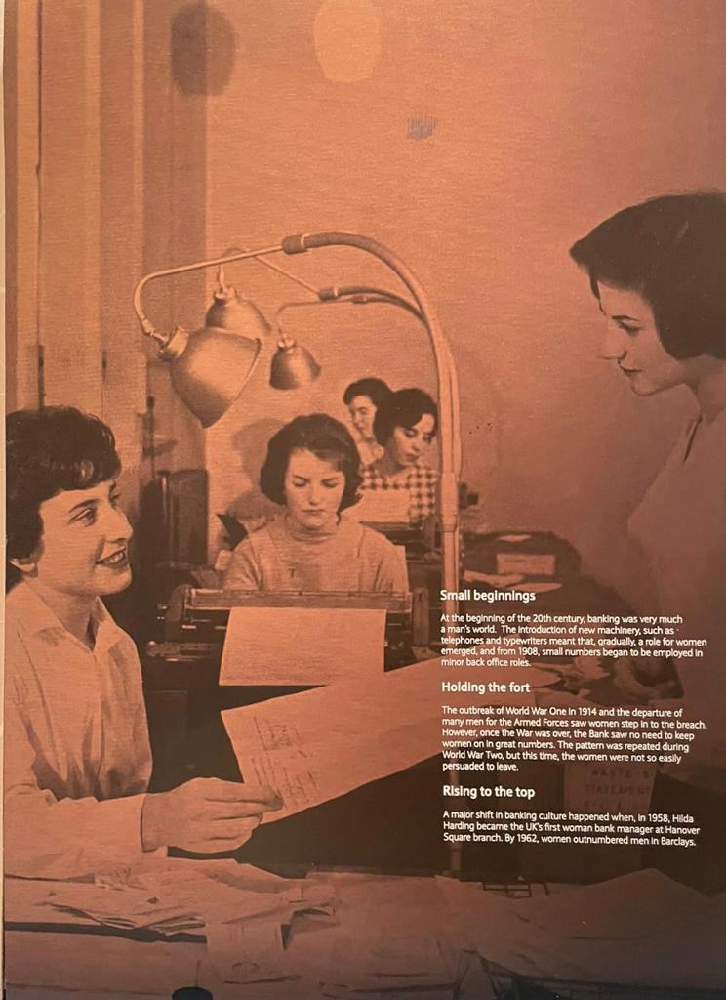
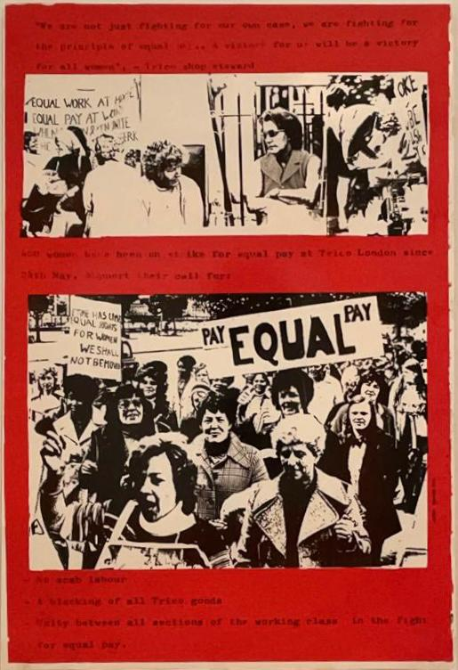

---
title: "página a"
--- 

Tengo un hilo preparado sobre por qué persisten las brechas de género, pero voy a esperar a mañana lunes para postearlo.

Spoiler alert: es el resultado de las **diferentes ocupaciones** que eligen mujeres y varones y de la **falta de mujeres en puestos de toma de decisión**.

Como me parecía un poco pesado para domingo, elegí compartir estas fotos sobre mujeres y mercado de trabajo. 

El otro día fui a un banco y vi esta imagen. El texto dice que al comienzo del s. XX, los hombres eran mayoría en el sector bancario. Luego vinieron las dos guerras mundiales, los hombres marcharon al frente, y las mujeres comenzaron a ocupar roles en el sector.

Entre las dos guerras, algo cambió. Al final de la primera guerra mundial, los hombres regresaron a sus puestos, y -muy diplomáticamente expresado en el texto de la foto- **"el banco no encontró necesario mantener en sus puestos a esas mujeres".** 

Al final de la segunda guerra mundial, sin embargo -y sigo parafraseando al texto- **"no fue tan fácil persuadir a las mujeres de que abandonaran sus puestos de trabajo".**

```{r nice-figt41, fig.cap="Brecha salarial de ingreso en Uruguay", out.width='80%', fig.asp=.5, fig.align='center', echo=FALSE}

```
El 15 de mayo de 1958, el hito fue que por primera vez una mujer, Hilda Harding, fue la primera mujer en el banco y en el Reino Unido en ser designada gerente de una sucursal. Hilda Harding tiene página en Wikipedia y todo: https://en.m.wikipedia.org/wiki/Hilda_Harding


Desde 1962 más mujeres que hombres trabajan en el banco Barclays. Tuvieron que pasar 20 años para que en 1983 una mujer se incorporara al directorio del banco (ese mismo banco con mayoría de mujeres en su personal desde 1962). Fue Mary Baker, quien trabajó por la paridad de género y la igualdad de oportunidades. 

Si te interesa, en el link hay perfiles de otras 5 mujeres que cambiaron la historia del empleo bancario. https://home.barclays/news/2021/04/From-the-archives--seven-female-pioneers-at-Barclays/

Esta otra foto es de un poster en el museo de Victoria y Alberto, en Londres. Es un poster de 1976 durante la huelga de la fábrica Trico de Londres, donde las mujeres reclaman por igualdad salarial.


```{r nice-figt42, fig.cap="Brecha salarial de ingreso en Uruguay", out.width='80%', fig.asp=.5, fig.align='center', echo=FALSE}

```
Por suerte, la **igualdad de remuneración por igualdad de trabajo** está reglamentada en muchos países. Desde 2019, en Uruguay hay una ley que promueve la igualdad de derechos y no discriminación entre varones y mujeres: https://www.impo.com.uy/genero/ 

Buen domingo, y a aprovechar el día!
